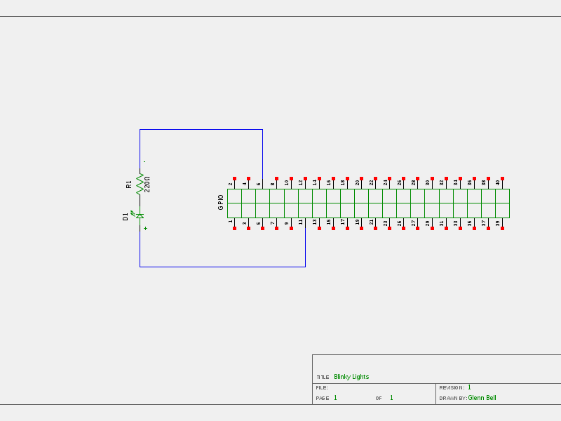

# Blinky Lights Lab

A simple circuit to control a light emitting diode (LED) with a Raspberry PI.

## Materials
* Raspberry PI 3 running Raspbian
* 1 - two lead colored LED
* 1 - 220Ω resistor (Red, Red, Black, Gold)
* 2 - male - male short jumpers
* 2 - male - female long jumpers

## Schematic
A graphical representation of the Blinky Lights Circuit.



## Wiring the Blinky Lights Lab


1. Insert a male - female long jumper in the hot (red) column
2. Insert a male - female long jumber in the ground (blue) column
3. Insert the LED into rows 15 (short lead) and 16 (long lead)
4. Insert the 220Ω into row 15, one lead on each side of the center line
5. Insert a male - male (short) jumper into the hot (red) column and row 16
6. Insert a male - male (short) jumper into the ground (blue) column and row 15

## Connect to the Raspberry PI


By Sinovoip (Own work) [CC BY-SA 4.0 (https://creativecommons.org/licenses/by-sa/4.0)], via Wikimedia Commons

1. Power down your Raspberry PI
	* Open a terminal window and type ```sudo halt```
	* Unplug the Raspberry PI
2. Connect the hot female connector to *Pin 11*
3. Connect the ground female connector to *Pin 6*
4. Boot your Raspberry PI
5. Open a terminal window
6. Execute ...
```blinkOnce.py```
```blinkOnce.java```
```blinkonce.c```

**Note: **You may need to compile the program.
	
Can you modify the included code to change its behavior?