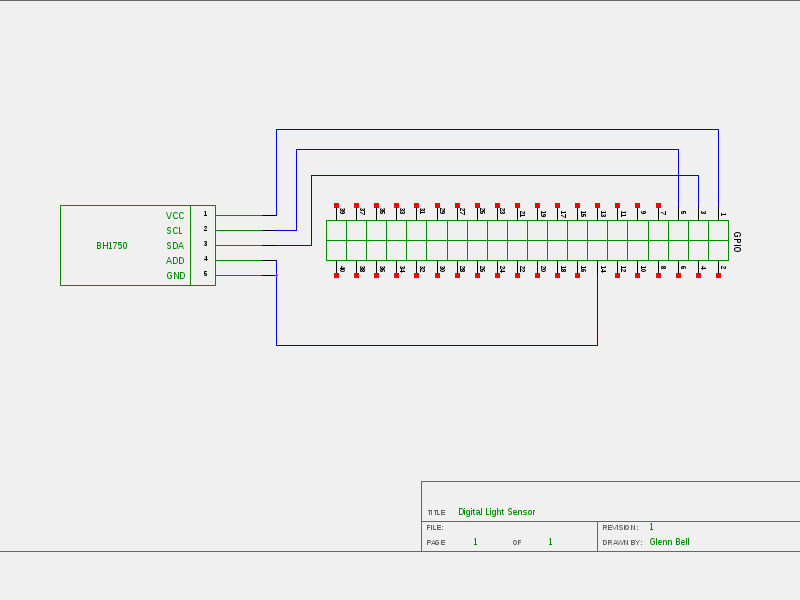
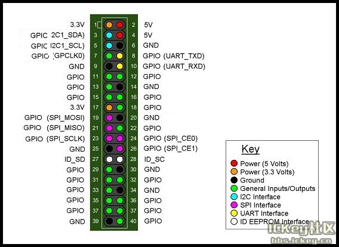

# Light Sensor Lab

A simple circuit to monitor light levels with a Raspberry PI.

## Materials
* Raspberry PI 3 running Raspbian
* 1 - bh1750 Digital Light Sensor
* 3 - male - male short jumpers
* 4 - male - female long jumpers

## Schematic
A graphical representation of the Light Sensor Circuit.



## Wiring the Light Sensor Lab


1. Insert a male - female long jumper in the hot (red) column
2. Insert a male - female long jumber in the ground (blue) column
3. Insert the bh1750 module into rows 15 (GND) through row 19 (VCC)
	* Refer to the wiring image for module orientation
4. Insert a male - male (short) jumper into the ground (blue) column and row 15
5. Insert a male - male (short) jumper into the ground (blue) column and row 16
6. Insert a male - male (short) jumper into the hot (red) column and row 19 (VCC)
7. Insert a male - female (long) jumper into row 17 (SCA)
8. Insert a male - female (long) jumper into row 18 (SCL)

## Connect to the Raspberry PI


By Sinovoip (Own work) [CC BY-SA 4.0 (https://creativecommons.org/licenses/by-sa/4.0)], via Wikimedia Commons


1. Power down your Raspberry PI
	* Open a terminal window and type ```sudo halt```
	* Unplug the Raspberry PI
2. Connect the hot female connector to *Pin 1*
3. Connect the ground female connector to *Pin 14*
4. Connect the female jumper from row 17 (SCA) to *Pin 3*
5. Connect the female jumper from row 18 (SCL) to *Pin 5*
6. **Verify your wiring! Mis-wiring will destroy the sensor!**
4. Boot your Raspberry PI
5. Open a terminal window
6. Execute ...

```LightSensor.py```

```lightsensor.c```

**Note: **You may need to compile the program.
	
Can you modify the included code to change its behavior?

[Return to Class Overview](../README.md)