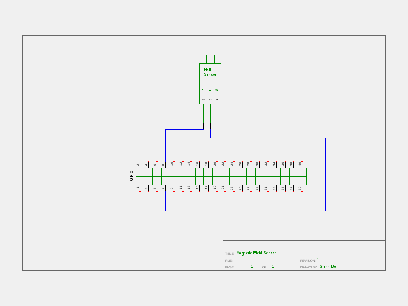
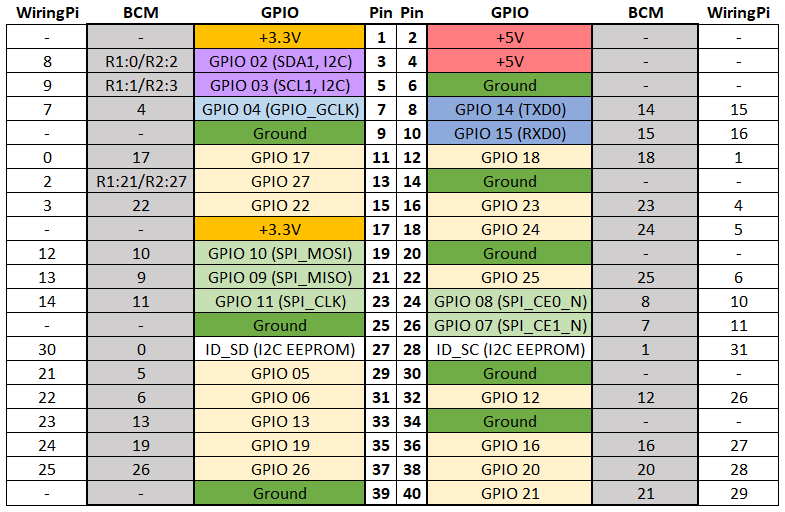

# Magnetic Field Sensor Lab

A simple circuit to detect magnetic fields with a Raspberry PI.

## Materials
* Raspberry PI 3 running Raspbian
* 1 - Hall Magetic Field Sensor
* 2 - male - male short jumpers
* 3 - male - female long jumpers

## Schematic
A graphical representation of the Light Sensor Circuit.



## Wiring the Magnetic Field Sensor Lab


1. Insert a male - female long jumper in the hot (red) column
2. Insert a male - female long jumber in the ground (blue) column
3. Insert the Hall module into rows 15 (GND) through row 17 (S)
	* Refer to the wiring image for module orientation
4. Insert a male - male (short) jumper into the ground (blue) column and row 15
5. Insert a male - male (short) jumper into the hot (red) column and row 16 (VCC)
6. Insert a male - female (long) jumper into row 17 (S)

## Connect to the Raspberry PI



1. Power down your Raspberry PI
	* Open a terminal window and type ```sudo halt```
	* Unplug the Raspberry PI
2. Connect the hot female connector to *Pin 2* (+5v)
3. Connect the ground female connector to *Pin 6* (Ground)
4. Connect the female jumper from row 16 (S) to *Pin 7* (GPIO 04)
5. **Verify your wiring! Mis-wiring will destroy the sensor!**
6. Boot your Raspberry PI
7. Open a terminal window
8. Execute ...
	* MagneticField.py
	* MagneticField.c

**Note: **You may need to compile the program.
	
Can you modify the included code to change its behavior?
* Change the message when an event is detected
* Change a while loop to a for loop

[Return to Class Overview](../README.md)