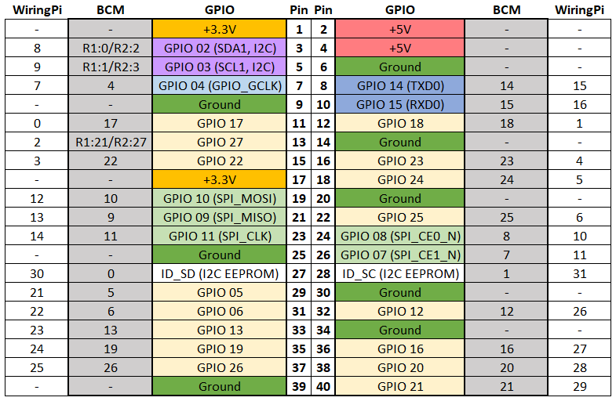

# Mercury Switch Lab

A simple circuit to detect tilting motions.

## Materials
* Raspberry PI 3 running Raspbian
* 1 - Mercury Switch Sensor
* 4 - male - male short jumpers
* 5 - male - female long jumpers
* 1 - Red two lead LED
* 1 - Green two lead LED
* 2 - 1K Ω Resistor (Brown, Black, Red, Gold)

## Schematic
A graphical representation of the Mercury Switch Circuit.


## Wiring the Mercury Switch Sensor Lab


1. Insert a male - female long jumper in the hot (red) column
2. Insert a male - female long jumber in the ground (blue) column
3. Insert the Mercury Switch into rows 15 (GND) through row 17 (S)
	* Refer to the wiring image for module orientation
4. Insert a male - male (short) jumper into the ground (blue) column and row 15
5. Insert a male - male (short) jumper into the hot (red) column and row 16 (VCC)
6. Insert a male - female (long) jumper into row 17 (S)
7. Insert the Green LED into rows 26 (short lead) and 27 (long lead)
8. Insert the Red LED into rows 26 (short lead) and 27 (long lead) on other side of the centerline
9. Insert two 1KΩ resistors into rows 27 and 30, one on each side of the centerline
10. Insert two male - male (short) jumpers into row 26 and the ground column, one on each side of the centerline
11. Insert two male - female (long) jumpers into row 30, one on each side of the centerline

## Connect to the Raspberry PI



1. Power down your Raspberry PI
	* Open a terminal window and type ```sudo halt```
	* Unplug the Raspberry PI
2. Connect the hot female connector to *Pin 4* (+5v)
3. Connect the ground female connector to *Pin 6* (Ground)
4. Connect the female jumper from row 17 (S) to *Pin 36* (GPIO 16)
5. Connect the female jumper from row 30 (Red LED) to *pin 38* (GPIO 20)
6. Connect the female jumper from row 30 (Green LED) to *pin 40* (GPIO 21)
5. **Verify your wiring! Mis-wiring will destroy the sensor!**
6. Boot your Raspberry PI
7. Open a terminal window
8. Execute ...
	* mercury.py

**Note: **You may need to compile the program.
	
Can you modify the included code to change its behavior?
* Swap the red and green LED actions
* Change a while loop to a for loop

[Return to Class Overview](../README.md)