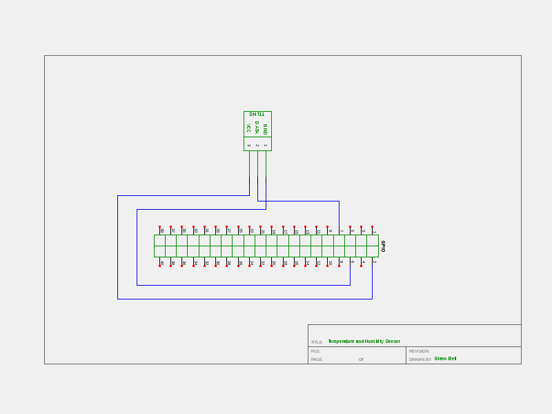

# Temperature and Humidity Sensor Lab

Measure Temperature and Humidity with a DHT11 Sensor

## Materials
* Raspberry PI 3 running Raspbian
* 1 - DHT11 Temperature Humidity Sensor
* 2 - male - male short jumpers
* 3 - male - female long jumpers

## Schematic
A graphical representation of the Temperature and Humidity Sensor Circuit.



## Wiring the Temperature and Humidity Sensor Lab


1. Insert a male - female long jumper in the hot (red) column
2. Insert a male - female long jumber in the ground (blue) column
3. Insert the Obstacle Avoidance Sensor into rows 15 (GND) through row 17 (VCC)
	* Refer to the wiring image for module orientation
4. Insert a male - male (short) jumper into the ground (blue) column and row 15 (GND)
5. Insert a male - male (short) jumper into the hot (red) column and row 17 (VCC)
6. Insert a male - female (long) jumper into row 16 (DATA)

## Connect to the Raspberry PI


1. Power down your Raspberry PI
	* Open a terminal window and type ```sudo halt```
	* Unplug the Raspberry PI
2. Connect the hot female connector to *Pin 2* (+5v)
3. Connect the ground female connector to *Pin 6* (Ground)
4. Connect the female jumper from row 17 (S) to *Pin 7* (GPIO 04 (GPIO_GCLK))
5. **Verify your wiring! Mis-wiring will destroy the sensor!**
6. Boot your Raspberry PI
7. Open a terminal window
8. Execute ...
	* dht11.py

**Note: **You may need to compile the program.
	
Can you modify the included code to change its behavior?
* Change a while loop to a for loop
* Change how temperatur and humidity is reported

[Return to Class Overview](../README.md)